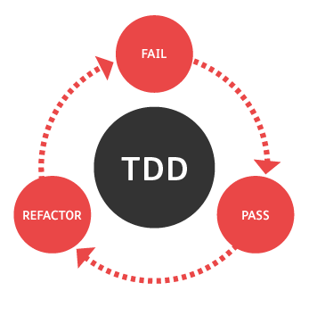
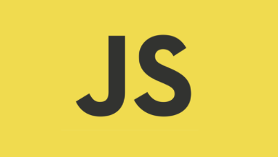
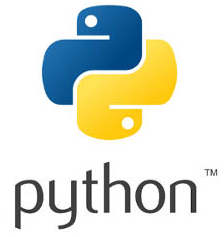
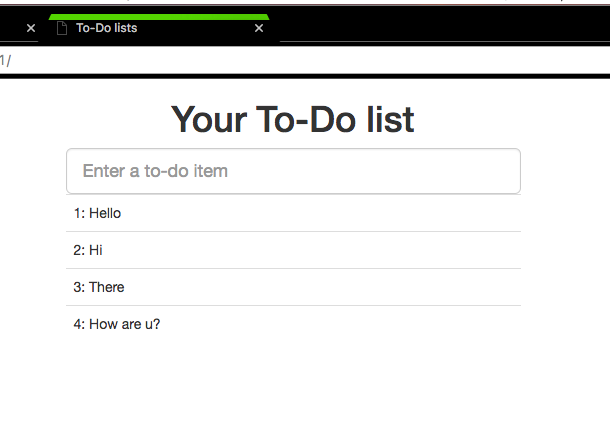
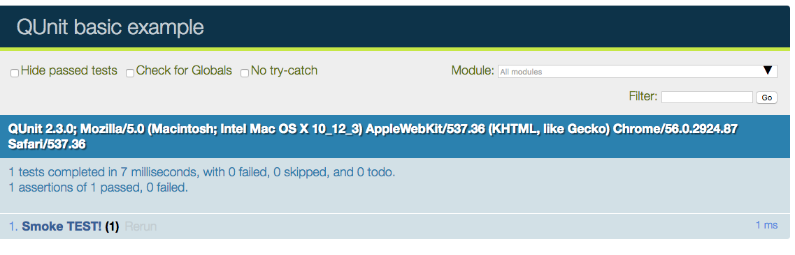

# Pycon2016-tdd with functional_view


#
<p align="left">
  
  
  
  
</p>
#


# Obey the Testing Goat!
# http://www.obeythetestinggoat.com/

<p align="left">
  
</p>


# DEMO With Unittest&Selenum 
<p align="left">
  
</p>

# DEMO With QUnit 
<p align="left">
  
</p>


# ipdb

```sh
$ ipdb ll     ==  list
$ ipdb s     ==  step 
$ ipdb q     ==  quit 
$ ipdb  etc etc etc ...     ==  etc... 
```

